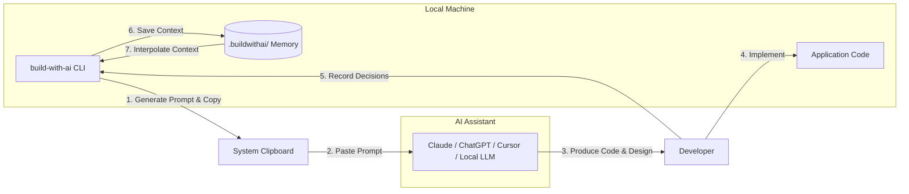

# build-with-ai

> A zero-API, local-first CLI that guides developers step-by-step through building complete software projects with any AI by generating deterministic, context-aware prompts at every engineering phase.

<div align="center">

[](https://github.com/PicadoLabs/build-with-ai/actions/workflows/ci.yml)
[](https://www.npmjs.com/package/build-with-ai)
[](https://www.npmjs.com/package/build-with-ai)
[](LICENSE)
[](https://nodejs.org)
[-8b5cf6.svg)](README.md)
[](CONTRIBUTING.md)

[Quickstart](#quickstart) • [How It Works](#how-it-works) • [Templates](#available-templates) • [Commands](#commands-reference) • [Architecture](#architecture--storage-design) • [Walkthrough](#walkthrough) • [Contributing](CONTRIBUTING.md)

</div>

---

## Overview

When building non-trivial applications with AI assistants (Claude, ChatGPT, Cursor, DeepSeek, local Ollama models), developers often encounter three problems:

1. **The Blank Canvas Problem:** Asking an AI to "build a whole app" produces monolithic, fragmented code.
2. **Context Drift:** As the chat progresses, the AI forgets foundational schema and architectural decisions made earlier.
3. **Skipped Phases:** Jumping directly to UI before establishing data contracts, authentication, or error handling.

`build-with-ai` solves this by breaking projects into disciplined, sequential phases (Discovery, Schema, Auth, Core CRUD, Testing, Deployment). It maintains a local context store (`context.json`) and automatically interpolates prior architectural decisions into downstream prompts (`{{decisions.key}}`).

### Core Guarantees
- **Zero API Keys & Zero Cost:** Runs 100% locally in your terminal. No third-party API accounts or rate limits required.
- **Universal Model Compatibility:** Use with any web interface, IDE plugin, or local model.
- **Non-Destructive:** Operates entirely within `.buildwithai/` and never touches or overwrites your application source files.

---

## How It Works



---

## Quickstart

Run directly without installation via `npx`:

```bash
npx build-with-ai
```

Or install globally:

```bash
npm install -g build-with-ai
```

Initialize a new project:

```bash
npx build-with-ai init
```

---

## Available Templates

`build-with-ai` includes 11 production-ready workflow templates:

| Template ID | Template Title | Steps | Primary Tech Stack |
| :--- | :--- | :---: | :--- |
| `web-app` | **Full-Stack Web Application** | 23 | Next.js / React, Tailwind CSS, Prisma ORM, PostgreSQL |
| `saas-mvp` | **Modern SaaS MVP** | 15 | Next.js 14 App Router, Supabase, Stripe, Resend Email |
| `rest-api` | **Backend REST API Service** | 10 | Node.js, Fastify / Express, PostgreSQL, Zod |
| `fastapi-backend` | **Python FastAPI Microservices** | 12 | Python 3.11+, FastAPI, Pydantic v2, Async SQLAlchemy 2.0, Alembic |
| `mobile-app` | **Cross-Platform Mobile App** | 15 | React Native, Expo Router, NativeWind, EAS Build |
| `flutter-app` | **Flutter Mobile Application** | 16 | Flutter 3.x, Dart, Riverpod / BLoC, Clean Architecture |
| `electron-app` | **Electron Desktop Application** | 12 | Electron, Vite, React, IPC Handlers, electron-builder |
| `chrome-extension` | **Chrome Browser Extension** | 12 | Manifest V3, Vite, React, Shadow DOM |
| `ai-agent` | **AI Agent & RAG Pipeline** | 14 | LangChain / LlamaIndex, Vector DB, FastAPI / Express |
| `ai-orchestration` | **AI Orchestration & Multi-Agent** | 14 | LangGraph / CrewAI, AutoGen, Vector DB, Telemetry |
| `discord-bot` | **Discord Bot Workflow** | 12 | Node.js, discord.js v14, Slash Commands, SQLite / PostgreSQL |

### Custom & Remote Templates

Load team-specific or custom templates directly from a local path or remote URL:

```bash
# Local template
npx build-with-ai init --template ./custom-template.json

# Remote template (HTTPS raw JSON)
npx build-with-ai init --template https://raw.githubusercontent.com/org/repo/main/template.json
```

See [CONTRIBUTING.md](CONTRIBUTING.md) for the template authoring specification and schema contracts.

---

## Walkthrough

### 1. Initialize
```bash
npx build-with-ai init
```
Select a template, experience level, and project overview. The `.buildwithai/` workspace is created.

### 2. Generate Prompt (`next`)
```bash
npx build-with-ai next
```
The CLI formats the active step, identifies recommended models and target files, and copies the prompt to your clipboard.

```text
STEP 1/15: Problem Discovery & SaaS Value Proposition
Phase: Discovery
Recommended AI: Claude 3.5 Sonnet / GPT-4o
Target Files: [None]

PROMPT FOR YOUR AI:
------------------------------------------------------------
I am building a SaaS product called "Invoice Tracker".
The concept is: A subscription SaaS for freelancers to automate invoicing.
My experience level is Intermediate.

Act as a SaaS product strategist:
1. Define the primary customer persona.
2. Formulate a 2-sentence value proposition.
------------------------------------------------------------
Prompt copied to clipboard.
```

### 3. Record Decisions (`done`)
Paste the prompt into your AI assistant, review the architectural output, and record the choices:

```bash
npx build-with-ai done
```
Enter decisions for required keys (e.g., `decisions.targetCustomer`, `decisions.coreValueProp`). Decisions are saved to `context.json`, and the project advances to the next step.

### 4. Automatic Context Injection
On subsequent steps, previous decisions are automatically injected into the generated prompt:

```text
STEP 3/15: Technology Stack Selection
Phase: Tech Stack

PROMPT FOR YOUR AI:
------------------------------------------------------------
My experience level is Intermediate and "Invoice Tracker" targets:
[Injected from Step 1: Freelance designers and agencies]

Recommend the optimal production tech stack...
------------------------------------------------------------
```

### 5. Inspect and Modify Decisions (`context` & `set`)
View stored decisions or update any value directly using dot-notation:

```bash
npx build-with-ai context
npx build-with-ai set decisions.database "PostgreSQL with Prisma"
```

### 6. Track Progress (`status` & `resume`)
```bash
npx build-with-ai status
```

```text
PROJECT STATUS: Invoice Tracker
Template:   Modern SaaS MVP
Progress:   [============------------] 47% (7/15 steps)

WORKFLOW STEPS:
  [x] 1. Problem Discovery [Discovery]
  [x] 2. MVP Feature Scoping [Requirements]
  [x] 3. Technology Stack Selection [Tech Stack]
  [x] 4. Database Schema Design [Database]
  [x] 5. API Routes & Server Actions [API]
  [x] 6. Authentication Setup [Authentication]
  [>] 7. Stripe Subscription Integration [Payments] (Current)
  [ ] 8. Transactional Email Pipeline [Email]
```

### 7. Export Documentation (`export`)
```bash
npx build-with-ai export
```
Generates standardized documentation from your build history:
- `README.md` — Project architecture and setup guide.
- `BUILD_LOG.md` — Chronological log of decisions and step history.
- `.buildwithai/CONTEXT.md` — Markdown projection of recorded state.

Use `--out-dir <path>` to export to a custom directory or `--dry-run` to preview output paths.

---

## Commands Reference

| Command | Description |
| :--- | :--- |
| `npx build-with-ai` | Interactive launcher displaying active status or starting initialization. |
| `npx build-with-ai init` | Start setup wizard (template selection, experience level, project concept). |
| `npx build-with-ai init --template <path\|url>` | Load a custom template from a local file path or remote HTTPS URL. |
| `npx build-with-ai next` | Generate and copy the prompt for the current step. |
| `npx build-with-ai next --no-copy` | Generate the step prompt without accessing the system clipboard. |
| `npx build-with-ai next --raw` | Output only the raw prompt string for scripting and CLI piping. |
| `npx build-with-ai next --json` | Output complete step metadata as structured JSON. |
| `npx build-with-ai done` | Record decisions, archive step logs, and advance to the next step. |
| `npx build-with-ai back` | Step back to the previous step without removing recorded context. |
| `npx build-with-ai jump [step]` | Navigate directly to a specific step number. |
| `npx build-with-ai context [key]` | Inspect recorded decisions or retrieve a specific dot-notation path. |
| `npx build-with-ai set <key> <value>` | Update a decision in `context.json` from the command line. |
| `npx build-with-ai status [--json]` | Display project progress bar, step list, and recorded decisions. |
| `npx build-with-ai history [step] [--json]` | Display archived AI responses and step logs. |
| `npx build-with-ai resume` | Overview dashboard summarizing active step and next action. |
| `npx build-with-ai export [--out-dir <dir>]` | Generate `README.md`, `BUILD_LOG.md`, and `CONTEXT.md`. |
| `npx build-with-ai list [-s <query>] [--json]` | List and search available templates with step counts. |
| `npx build-with-ai reset` | Remove `.buildwithai/` state while leaving project source code intact. |

### Headless & CI Scripting

Use `--json` or `--raw` to integrate `build-with-ai` with automated pipelines or editor extensions:

```bash
# Extract prompt using jq (macOS / Linux)
npx build-with-ai next --json | jq -r '.prompt'

# Extract prompt in PowerShell (Windows)
npx build-with-ai next --json | ConvertFrom-Json | Select-Object -ExpandProperty prompt

# Disable clipboard globally in headless environments
export BUILD_WITH_AI_NO_COPY=1
```

---

## Architecture & Storage Design

All metadata and state are stored in a self-contained `.buildwithai/` directory within your project root:

```text
my-project/
├── .buildwithai/
│   ├── state.json        # Progress tracking (currentStep, completedSteps, timestamps)
│   ├── context.json      # Structured decisions store (single source of truth)
│   ├── CONTEXT.md        # Formatted markdown view of context.json
│   └── history/          # Archived step responses (step-01.md, step-02.md, ...)
├── src/                  # User application code (never touched by the CLI)
├── README.md             # Generated on export
└── BUILD_LOG.md          # Generated on export
```

### Branch-scoped storage (multi-branch workflows)

By default, all git branches share the single `.buildwithai/` directory. Set `BUILD_WITH_AI_BRANCH_SCOPED=1`
to isolate state per branch:

```bash
export BUILD_WITH_AI_BRANCH_SCOPED=1
```

When enabled, the CLI detects the current git branch and stores that branch's `state.json`, `context.json`
and `history/` under `.buildwithai/branches/<branch-name>/` instead. Branch names are sanitized into a
single safe directory segment (e.g. `feature/auth` becomes `feature-auth`), so they can never escape the
`branches/` directory. When git is unavailable, the directory is not a git repository, or HEAD is detached,
the CLI falls back to the default shared `.buildwithai/` storage. `reset` only clears the current branch's
storage; other branches are left untouched.

---

## Contributing

Contributions are welcome. Please read [CONTRIBUTING.md](CONTRIBUTING.md) for details on code style, template schema requirements, and pull request procedures.

Please also review our [Code of Conduct](CODE_OF_CONDUCT.md).

---

## Security

If you discover a security vulnerability, please review our [Security Policy](SECURITY.md) and report it privately to [picadolabs@gmail.com](mailto:picadolabs@gmail.com).

---

## Maintainers

`build-with-ai` is maintained by [PicadoLabs](https://picadolabs.me).

- **Maintainer:** [Kaap10](https://github.com/Kaap10)
- **Organization:** [PicadoLabs](https://github.com/PicadoLabs)
- **Contact:** [picadolabs@gmail.com](mailto:picadolabs@gmail.com)

---

## License

This project is licensed under the **Apache License 2.0** - see the [LICENSE](LICENSE) file for details.

Copyright (c) 2026 PicadoLabs.
